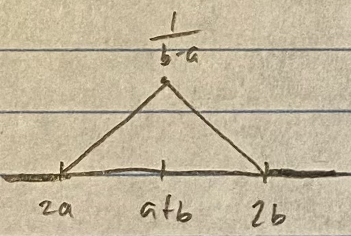
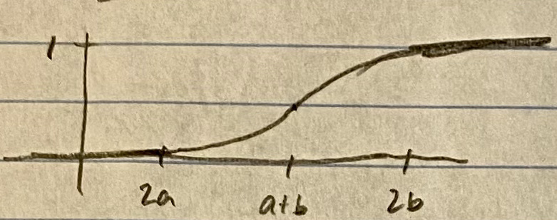

```{r setup, include=FALSE}
knitr::opts_chunk$set(echo = TRUE)

pacman::p_load(pacman, statmod, lme4, stats)
```

# 1. 

Consider the integral
$$
I=\int_{0}^{10} \exp \left(\frac{-1}{1+x^{2}}\right) d x
$$


## (a)

Approximate $I$ using the Newton–Cotes quadrature rule of order $n = 7$. 

Newton-Cotes is defined by:
$$
Q_{7}^{NC}=\sum_{i=1}^{7} w_{i} f\left(x_{i}\right)
$$
The $x_i$ are defined by the following equation:
$$
x_{i}=a+(i-1)(b-a)/(n-1), \quad i=1, \ldots, n, \quad a=0, \quad b=10, \quad n=7
$$

```{r}
n <- 7
a <- 0
b <- 10
(xa <- seq(from = a, to = b, by = (b-a)/(n-1)))
```

The computation of $Q_{7}^{NC}$ can be done by noting that the Newton–Cotes rule of order $n$ is exact for any polynomial of degree less than or equal to $n−1$:
$$
Q_{7}^{NC}(p)=\sum_{i=1}^{7} w_{i} p\left(x_{i}\right)=\int_{0}^{10} p(x) d x, \quad p(x)=x^{j}, \quad j=0, \ldots, n-1
$$

The quadrature weights then satisfy the system of equations below:
$$
\left\{\begin{array}{l}
w_{1}+w_{2}+w_{3}+w_{y}+w_{5}+w_{6}+w_{7}=10 \\
0 w_{1}+\frac{5}{3} w_{2}+\frac{10}{3} w_{3}+\frac{15}{3} w_{4}+\frac{20}{3} w_{5}+\frac{25}{3} w_{6}+10 w_{7}=\frac{10^{2}}{2}=50 \\
...\\
...\\
0 w_{1}+\left(\frac{5}{3}\right)^{6} w_{2}+\left(\frac{10}{3}\right)^{6} w_{3}+\left(\frac{15}{3}\right)^{6} w_{4}+\left(\frac{20}{3}\right)^{6} w_{5}+\left(\frac{25}{3}\right)^{6} w_{6}+10^{6} w_{7}=\frac{10^{7}}{7}
\end{array}\right.
$$

This can be rewritten as $X\textbf{w} = \textbf{y}$ where X is the coefficients, $\textbf{w}$ is the weights, and $\textbf{y}$ is the terms to the right of the equal sign.  The solution for $\textbf{w}$ is therefore:
$$
X^{-1} X \textbf{w}=X^{-1} \textbf{y} \quad \Rightarrow \quad \textbf{w}=X^{-1} \textbf{y}
$$
```{r}
# Set up X matrix and y vector
Xa_matrix <- matrix(nrow = n, ncol = n)
ya <- vector(mode = "numeric", length = n)
for (i in 1:n) {
  Xa_matrix[i,] <- xa^(i-1)
  ya[i] <- (b-a)^i/i
}

(wa <- solve(Xa_matrix) %*% ya)   # Find weights by solving X-inverse times y
```

We can then approximate the integral using the Newton-Cotes equation above.
$$
Q_{7}^{NC}=\sum_{i=1}^{7} w_{i} f\left(x_{i}\right)
$$

```{r}
prob1afunc <- function(x) { return( exp(-1/(1+x^2)) ) }   # Define function to be integrated

(Q1a <- sum(wa * prob1afunc(xa)))
```


## (b)

Approximate $I$ using using a Gauss quadrature rule of order $n = 7$.

We can convert the bounded integral:
$$
I=\int_{0}^{10} \exp \left(\frac{-1}{1+x^{2}}\right) d x
$$

Using the following change of variables:
$$
t=(2 x-(a+b)) /(b-a) \quad \Rightarrow \quad x=((b-a) t+a+b) / 2, \quad d x=(b-a) / 2 \; dt
$$

This leads to a revised integral:
$$
\int_{a}^{b} f(x) d x=\frac{b-a}{2} \int_{-1}^{1} f\left(\frac{(b-a) t+a+b}{2}\right) d t
$$

The corresponding Gauss-Legendre quadrature equation is then ($a=0, \; b=10$):
$$
Q_{7}^{G L}(f)=\frac{b-a}{2} \sum_{i=1}^{7} w_{i} f\left(\frac{(b-a) x_{i}+a+b}{2}\right)=5 \sum_{i=1}^{7} w_{i} f\left(5 x_{i}+5\right)
$$

The $x_i$ are the roots of the Legendre polynomial of degree 7:
$$
P_{7}(x)=\frac{1}{16}\left(429 x^{7}-693 x^{5}+315 x^{3}-35 x\right)
$$

They can be calculated using `polyroot` in R:
```{r}
# Find roots of Legendre polynomial of degree 7:  1/16 * (429*x^7 - 693*x^5 + 315*x^3 - 35*x)
(xb <- sort(Re(polyroot(1/16 * c(0, -35, 0, 315, 0, -693, 0, 429)))))
```

The weights can then be derived using the same method outlined in (a):
$$
\textbf{w}=X^{-1} \textbf{y}
$$

The $X$ matrix is determined as in (a), and each $y_i$ is $(1^i-(-1)^i)/i$.

```{r}
Xb_matrix <- matrix(nrow = n, ncol = n)
yb <- vector(mode = "numeric", length = n)
for (i in 1:n) {
  Xb_matrix[i,] <- xb^(i-1)
  yb[i] <- (1^i-(-1)^i)/i
}
(wb <- solve(Xb_matrix) %*% yb)   # Find weights by solving X-inverse times y

#leg <- gauss.quad(n = 7, kind = "legendre")   #Alternative way to get weights and nodes
```

As mentioned above, we can now approximate the integral with:
$$
Q_{7}^{G L}(f)=5 \sum_{i=1}^{7} w_{i} f\left(5 x_{i}+5\right)
$$

```{r}
(Q1b <- (b-a)/2 * sum(wb * prob1afunc(((b-a)*xb + a + b)/2)))
```


## (c)

Which of the above approximations is better? Decide by approximating $I$ using the R function `integrate`.

```{r}
(Q1c <- integrate(prob1afunc, lower = a, upper = b))
(Q1a-Q1c$value)/Q1c$value   #Relative error between Newton-Cotes and integrate()
(Q1b-Q1c$value)/Q1c$value   #Relative error between Gauss-Legendre and integrate()
```
We can see that Gauss-Legendre of $n=7$ is better in this case; its relative error is less than 0.0003.  Newton-Cotes of $n=7$ has a relative error over 0.006, more than an order of magnitude larger.


## (d)

Approximate the integral
$$
\int_{1}^{\infty} \frac{x+1}{x^{4}} d x
$$
using the Gauss–Laguerre quadrature rule of orders $n = 10$ and $100$. Compare your answers with the one obtained using `integrate`.

We must perform a change of variables to get the integral into proper Gauss-Laguerre format.  Let $t=x-1$, so $dt=dx$ and $x=t+1$.  The integral then becomes:
$$
\int_{1}^{\infty} \frac{x+1}{x^{4}} d x=\int_{0}^{\infty} \frac{t+2}{(t+1)^{4}} d t=\int_{0}^{\infty} t^{0} e^{-t} e^{t} \frac{t+2}{(t+1)^{4}} d t
$$
$$
=\int_{0}^{\infty} t^{0} e^{-t} f(t) d t \quad \text { where } \quad f(t)=e^{t} \frac{t+2}{(t+1)^{4}}
$$

We can then define the original function and the Gauss-Legere function:
```{r}
prob1dorig <- function(x) { return( (x+1) / x^4 ) }   # Define function to be integrated
prob1dfunc <- function(t) { return( exp(t)*(t+2) / (t+1)^4 ) }   # Define function for Gauss-Laguerre
```

We can get the weights and nodes for Gauss-Laguerre using the R function `gauss.quad`:
```{r}
lag10 <- gauss.quad(n = 10, kind = "laguerre", alpha = 0)   #Get weights and nodes
lag100 <- gauss.quad(n = 100, kind = "laguerre", alpha = 0)   #Get weights and nodes
```

And now we can calculate the integral approximation using:
$$
Q_{n}^{G L}=\sum_{i=1}^{n} w_{i} f\left(x_{i}\right)
$$

```{r}
(Q1d_n10 <- sum(lag10$weights * prob1dfunc(lag10$nodes)))   #For n=10
(Q1d_n100 <- sum(lag100$weights * prob1dfunc(lag100$nodes)))   #For n=100
```

And comparing with `integrate`:
```{r}
(Q1d <- integrate(prob1dorig, lower = 1, upper = Inf))
(Q1d_n10-Q1d$value)/Q1d$value   #Relative error between Gauss-Laguerre, n=10, and integrate()
(Q1d_n100-Q1d$value)/Q1d$value   #Relative error between Gauss-Laguerre, n=100, and integrate()
```
As expected, the higher value for $n$ provides a more accurate approximation.  For $n=100$, the relative error is less than 0.000004, whereas $n=10$ sees a relative error just under 0.002.  This is roughly 3 orders of magnitude difference!


\pagebreak

# 2. 

Browse the article: Lesaffre, E. and Spiessens, B. (2001), On the Effect of the Number of
Quadrature Points in a Logistic Random–Effects Model: An Example, *Applied Statistics*,
50, 325-335. This article deals with a randomized, double–blind, parallel–group, multicenter
study involved 294 patients to compare two oral treatments (denoted A and B) for toenail
infection. Patients were evaluated at week 0 (baseline) and at weeks 4, 8, 12, 24, 36, and
48. For each visit the response was a binary variable indicating the presence of onycholysis
(separation of the nail plate from the nail bed). Interest centers in the rate of decline of the
proportion of patients with onycholysis over time and the effects of treatment on that rate.
The data are at: http://faculty.business.utsa.edu/vdeolive/toenail.txt
The meaning of the first four columns are respectively: patient ID, binary response, treatment
code and time of evaluation from the start (in months).

Let $Y_{ij}$ denote the binary response of the $i^{th}$ patient in the $j^{th}$ visit, $i = 1,...,294$ and $j = 1,...,7$. A possible model for these data is the following generalized linear mixed model: 

$$ Y_{ij}|\gamma_i \overset{\mathrm{ind}}\sim  Ber(\pi_{ij}(\boldsymbol{\beta},\gamma_i))$$
$$\gamma_i \overset{\mathrm{i.i.d.}}\sim N(0,\sigma^2),     i = 1,...,294; j = 1,...,7$$

where

$$ \pi_{i,j}(\boldsymbol{\beta}, \gamma_i) = P_\beta(Y_{ij} = 1 | \gamma_i,\boldsymbol{x}_{ij}) =\frac{exp(\beta_0 +\beta_1trt_i +\beta_2t_{ij}+\beta_3t_{ij} \cdot trt_i+\gamma_i)}{1+exp(\beta_0 +\beta_1trt_i +\beta_2t_{ij}+\beta_3t_{ij} \cdot trt_i+\gamma_i)}  $$
$\boldsymbol{\beta} = (\beta_0,\beta_1,\beta_2,\beta_3)$ are unknown parameters and $\boldsymbol{x}_{ij} = (trt_i, t_{ij} )$ are known covariates, with
$trt_i$ the treatment indicator of patient $i$ (= 1 if patient $i$ received treatment B, = 0 otherwise), and $t_{ij}$ is the time from the start of treatment of the $j^{th}$ visit for the $i^{th}$ patient.


## (a) 

Compute the MLE of  $$\boldsymbol{\eta} = (\boldsymbol{\beta_0}', \sigma^2)$$  and their approximate standard errors. You may either
adapt to the above model the code in the handout for the mixed effect model for count data,or else use the function `glmer` in the R package `lme4`.

The likelihood function must bederived in order to find the MLE:

$$ L(\boldsymbol{\beta}, Y) = P_\beta(Y) = \int_{I\!R^{294}} P(Y,\gamma)d\gamma = \int_{I\!R^{294}} P(Y|\gamma)P(\gamma)d\gamma$$

By independence,

$$= \int_{I\!R^{294}} \prod^{294}_{i=1} P(Y_i|\gamma_i)P(\gamma_i)d\gamma_i$$
Integrand is product of one-variable functions:

$$= \prod^{294}_{i=1} \int_{-\infty}^{\infty} P(Y_i|\gamma_i)P(\gamma_i)d\gamma_i$$

$$= \prod^{294}_{i=1} \int_{-\infty}^{\infty}  \prod^7_{j=1}[P(Y_{ij}|\gamma_i)]P(\gamma_i)d\gamma_i$$
Recall Bernoulli PMF and standardized normal PDF:

$$Bernoulli: f(x) = p^x(1-p)^{1-x}$$
$$Normal: f(x) = \frac{1}{\sqrt{2\pi}}e^{-x^2/2}$$

Recall Gauss-Hermite quadrature form:

$$\int_{-\infty}^{\infty}e^{-x^2}f(x)dx \approx \sum_{i=1}^n w_if(x_i)$$
Plug back into equation:

$$= \prod^{294}_{i=1} \int_{-\infty}^{\infty}  \prod^7_{j=1}(p^{{Y_{ij}}} (1-p)^{1-Y_{ij}})\frac{1}{\sigma}\phi(\frac{\gamma_i}{\sigma})d\gamma_i$$

where:

$$\frac{1}{\sigma}\phi(\frac{\gamma_i}{\sigma}) = \frac{1}{\sigma\sqrt{2\pi}}\int_{-\infty}^xe^{- \bigl( \frac{\gamma_i}{\sigma} \bigr)^2 /2}  dt$$
with u-substitution:

$$u_i = \frac{\gamma_i}{\sigma\sqrt2} ~~~~~~~~~~~~~~~~~ du_i = \frac{1}{{\sigma\sqrt2}}d\gamma_i  $$
resulting in:

$$\frac{1}{\sigma}\phi(\frac{\gamma_i}{\sigma}) = e^{-u{_i}^2}du_i$$
Now plug back into equation again to obtain final likelihood equation:

$$= \prod^{294}_{i=1} \int_{-\infty}^{\infty}  \prod^7_{j=1}(p^{{Y_{ij}}}(1-p)^{1-Y_{ij}})e^{-u{_i}^2}du_i$$
and log likelihood is:


$$l = log(\prod^{294}_{i=1} \int_{-\infty}^{\infty}  \prod^7_{j=1}(p^{{Y_{ij}}}(1-p)^{1-Y_{ij}})e^{-u{_i}^2}du_i)$$

$$ = \sum^{294}_{i=1}log(\int_{-\infty}^{\infty}  \prod^7_{j=1}(p^{{Y_{ij}}}(1-p)^{1-Y_{ij}})e^{-u{_i}^2}du_i))$$

Now put in Gauss-Hermite form: 

$$=\int_{-\infty}^{\infty}e^{-u_{i}^2}f(\boldsymbol{\beta},\boldsymbol{y_i},\sigma\sqrt2u_i)du_i \approx \sum_i^nw_if(\boldsymbol{\beta},\boldsymbol{y_i},\sigma\sqrt2u_i)$$

where:

$$f(\boldsymbol{\beta},\boldsymbol{y_i},\sigma\sqrt2u_i) = \prod^7_{j=1}(p^{{Y_{ij}}}(1-p)^{1-Y_{ij}}) $$

and 

$$
p = \pi_{i,j}(\beta,\gamma_i)~~~~~~~~~~~~~~~~~ from~ above
$$

Now we can start to find the MLE of $\eta$ by maximizing the log-likelihood equation, utilizing the optim function in base-r. As the notes mention the evaluation of each summand in the log-likelihood requires an approximation of the integral over the real line. The implementation of that approximation and the resulting solution is as follows:

```{r}
library(statmod)
library(data.table)

# Import data
d <- read.table("http://faculty.business.utsa.edu/vdeolive/toenail.txt",header=FALSE)
names(d) <- c("patient", "response", "treatment", "time", "visit")

# A quick observation of the data makes it clear that some data is missing
# Create a patient_count variable in the dataset to denote this is the nth patient, 
# rather than using their IDs, which have gaps
cur_patient <- 0
pat_count <- 0
d$patient_count <- vector(mode = "numeric", length = nrow(d))
for (index in 1:nrow(d)) {
  if (d[index,]$patient != cur_patient) {
    cur_patient <- d[index,]$patient
    pat_count <- pat_count + 1
  }
  d[index,]$patient_count <- pat_count
}


# We are interested in approximating the log-likelihood using numerical integration methods

# Function to compute f(beta, yi, trti, txi, sqrt(2)*sigma*u)
f <- function(u, eta, yi, trti, txi) {
  # u is a transformation of gammai; gammai = sqrt(2)*sigma*u (scalar)
  # eta is a length 5 list with beta_0, beta_1,beta_2,beta_3,sigma
  # trti is treatment indicator (scalar)
  # txi is time from the start of treatment of the jth visit for the ith patient (vector of length 7 or fewer)
  # yi is the response for the ith patient at each visit (vector of same length as txi)

  a <- eta[1] + eta[2]*trti + eta[3]*txi + eta[4]*txi*trti + sqrt(2)*eta[5]*u
  p <- exp(a)/(1+exp(a))
  return( prod(p^yi * (1-p)^(1-yi)) ) 
}


fv <- Vectorize(f, vectorize.args = "u")   #This allows for many values of u to be submitted to f at once 
                                           #and evaluated in vector form, rather than a loop

# Compute the points and weights of for the Gauss-Hermite quadrature
b <- gauss.quad(n = 100, kind = "hermite")


# Function to approximate the negative log-likelihood, using Gauss-Hermite quadrature

# statistical packages usually work at minimizing functions
# so in order to find the maximum of a function we need to find the min of the negative of that function 
# because max(x) = min(-x)

neg_loglik_appx <- function(eta, data) {
  # eta = (beta_0, beta_1, beta_2, beta_3, sigma)
  # data = full data set (includes at least response, treatment, time, patient_count)
  # b = dataframe with weights and nodes (Hermite), exists outside this function

  # Approximate the integral for each patient
  n <- length(unique(data$patient_count))
  integral_appx <- c()
  for (pat in 1:n) {
    the_rows <- which(data$patient_count == pat)
    yi <- data[the_rows,]$response
    trti <- data[the_rows[1],]$treatment
    txi <- data[the_rows,]$time
    integral_appx[pat] <- sum(b$weights * fv(b$nodes, eta, yi, trti, txi))
  }
  
  # Combine all patients with negative sum of logs
  return(-sum(log(integral_appx)))
}


# Now optimize to find the MLE
# This may take a while so be patient :) 
eta0 <- c(0, 0, 0, 0, 1) # Initial values
ml <- optim(eta0, neg_loglik_appx, data = d, method = "L-BFGS-B",
            lower = c(-Inf, -Inf, -Inf, -Inf, 0), 
            upper = c(Inf, Inf, Inf, Inf, Inf), hessian = TRUE)

## Maximum likelihood estimates of beta_0, beta_1, beta_2, beta_3, and sigma
est <- ml$par
est
## Approximate standard errors of the ML estimators
se<-sqrt(diag(solve(ml$hessian)))
se

```


## (b) 

Interpret the results.

From the Table and plot below we can see as the weeks increase, as well as if the treatment is present the presence of a toenail infection is reduced. 
```{r}
#create 95% Confidence intervals
lower_bound <- est-1.96*se
upper_bound <- est+1.96*se
dt <- data.table(c("beta_0", "beta_1", "beta_2", "beta_3", "sigma"),est,lower_bound,upper_bound)
dt

p_bernoulli <- function(eta,  trti, txi) {
  # u is a transformation of gammai; gammai = sqrt(2)*sigma*u (scalar)
  # eta is a length 5 list with beta_0, beta_1,beta_2,beta_3,sigma
  # trti is treatment indicator (scalar)
  # txi is time from the start of treatment of the jth visit for the ith patient (vector of length 7 or fewer)
  
  a <- eta[1] + eta[2]*trti + eta[3]*txi + eta[4]*txi*trti
  return(exp(a)/(1+exp(a)))
}
p_ber_1 <- p_bernoulli(est,1,1:7)
p_ber_0 <- p_bernoulli(est,0,1:7)
plot(1:7*4,p_ber_0,type = "l",ylab = "Probability of Toenail Infection Presence",xlab = "Week")
lines(1:7*4,p_ber_1,col=3)
points(1:7*4,p_ber_0,)
points(1:7*4,p_ber_1,col=3)
legend(20,.105,c("Treatment", "No Treatment"), lty = c(1,1),col = c(3,1))
```


\pagebreak


# 3.
 
Let F be an arbitrary cumulative distribution function on R that is continuous and strictly
increasing.

## (a)

Write an R function that simulates a random sample from F by finding a root of an
appropriate function. The function arguments must be m = the number of required draws
and F, a continuous and strictly increasing cdf.

Given the constraints above there exists a real number for which F(x) = y, so the root of G(x) = F(x) - y would give us that real Number, the simulation function is below, we've also included an optional interval vector. 

```{r}

sim <- function(F,m,interval=c(-100,100)){
  # The function arguments must be m = the number of required draws,
  # and F, a continuous and strictly increasing cdf.
  # Added a third optional variable, interval, which is the interval over which to evaluate F (needed for root-finding).
  #   interval should be formatted as a length-2 vector as seen in the default value in the function definition.
  
  F.inv <- function(y){uniroot(function(x){F(x)-y},interval=interval)$root}
  F.inv <- Vectorize(F.inv) #need to vectorize for uniroot to work

  X <- runif(m,0,1)   # random sample from U[0,1]
  Z <- F.inv(X)    #Calculate inverse CDF using root-finding for each draw from Uniform(0,1)

  return(Z) 
}


```

## (b)

Use your function to simulate one random sample of size 10000 from the Gamma(3, 1)
distribution, and one random sample of size 10000 from the Gamma(0.3, 1) distribution.
Assess the adequacy of your output by overlaying in the same plot the histogram of your
output and the density of the distribution.

From the plots below we can see the output displayed by the historgrams very closelly resembles the density of the distribution passed to the function. 

```{r}

m <- 10000

gamma_3_1 <- function(x) { return(pgamma(x, shape = 3, scale = 1)) }   #CDF of Gamma(3,1)
set.seed(1)
output_1 <- sim(m = m, F = gamma_3_1, interval = c(0,100))
hist(output_1, probability = TRUE, ylim = c(0,0.3), main = "Random sampling from Gamma(3,1)", xlab = "x")
range_1 <- seq(from = 0, to = 12, by = 0.01)
lines(x = range_1, y = dgamma(range_1, shape = 3, scale = 1), col = 2)   #Add actual density curve

gamma_03_2 <- function(x) { return(pgamma(x, shape = 0.3, scale = 1)) }   #CDF of Gamma(0.3,1)
set.seed(1)
output_2 <- sim(m = m, F = gamma_03_2, interval = c(0,100))
hist(output_2, probability = TRUE, main = "Random sampling from Gamma(0.3,1)", xlab = "x")
range_2 <- seq(from = 0, to = 6, by = 0.01)
lines(x = range_2, y = dgamma(range_2, shape = 0.3, scale = 1), col = 2)   #Add actual density curve

```

## (c)

Plot the quantile function of the Gamma(3, 1) distribution against an empirical quantile
function of the simulated data (read Examples 3.2 and 3.8 in the textbook).

Notice as our sample increases, we begin to deviate from the normal line as expected in the gamma family.  

```{r}
q <- qgamma(ppoints(m), shape = 3, scale = 1)   # Quantile points for true density
qqplot(q, output_1, cex = 0.5, xlab = "Gamma(3,1)", ylab = "Sample")
abline(0,1)

```

\pagebreak


# 4.

Let $X$ be a random variable with “triangular” distribution on $(2a, 2b)$, with $a < b$, whose pdf is
$$
f(x)=\left\{\begin{array}{ll}
0 & \text { if } x<2 a \text { or } x>2 b \\
\frac{x-2 a}{(b-a)^{2}} & \text { if } 2 a \leq x<a+b \\
\frac{2 b-x}{(b-a)^{2}} & \text { if } a+b \leq x \leq 2 b
\end{array}\right.
$$


## (a)

Compute the corresponding cdf $F(x)$.

Here is a sketch of $f(x)$:  


We first compute the integral of $f(x)$ on the interval $2a \leq x < a+b$, which will correspond to $F(x)$ over that same range:

$$
\int_{2 a}^{x} \frac{t-2 a}{(b-a)^{2}} dt=\frac{1}{(b-a)^{2}} \int_{2 a}^{x} (t-2 a) d t=\frac{1}{(b-a)^{2}}\left[\frac{1}{2} t^{2}-2 a t\right]_{2 a}^{x}
$$
$$
=\frac{1}{(b-a)^{2}}\left(\frac{1}{2} x^{2}-2 a x-\left(2 a^{2}-4 a^{2}\right)\right)=\frac{1}{(b-a)^{2}}\left(\frac{1}{2} x^{2}-2 a x+2 a^{2}\right)
$$

Plugging $x = a+b$, the upper bound of this region, into the equation above indeed gives $\frac{1}{2}$, as we would expect from the sketch, because the PDF is symmetric about this point.

We now compute the integral of $f(x)$ on the interval $a+b \leq x \leq 2b$, which will be added to $\frac{1}{2}$ to give $F(x)$ over that range:

$$
\int_{a+b}^{x} \frac{2 b-t}{(b-a)^{2}} d t=\frac{1}{(b-a)^{2}} \int_{a+b}^{x} (2 b-t) d t=\frac{1}{(b-a)^{2}}\left[2 b t-\frac{1}{2} t^{2}\right]_{a+b}^{x}
$$
$$
=\frac{1}{(b-a)^{2}}\left(2 b x-\frac{1}{2} x^{2}-\left(2 a b+2 b^{2}-\frac{1}{2}(a+b)^{2}\right)\right)=\frac{1}{(b-a)^{2}}\left(2 b x-\frac{1}{2} x^{2}-2 a b-2 b^{2}+\frac{1}{2} a^{2}+a b+\frac{1}{2} b^{2}\right)
$$

$$
=\frac{1}{(b-a)^{2}}\left(-\frac{1}{2} x^{2}+2 b x+\frac{1}{2} a^{2}-a b-\frac{3}{2} b^{2}\right)
$$

This results in a final formula for $F(x)$ as follows:
$$
F(x)=\left\{\begin{array}{lll}
0 & , \text { if } x<2 a \\
\frac{1}{(b-a)^{2}}\left(\frac{1}{2} x^{2}-2 a x+2 a^{2}\right) & , \text { if } 2 a \leq x<a+b \\
\frac{1}{2}+\frac{1}{(b-a)^{2}}\left(-\frac{1}{2} x^{2}+2 b x+\frac{1}{2} a^{2}-a b-\frac{3}{2} b^{2}\right) & , \text { if } a+b \leq x<2 b \\
1 & , \text { if } x \geq 2 b
\end{array}\right.
$$


## (b)

Compute $Q(u)$, the quantile function corresponding to $F$.

We begin with a sketch of $F(x)$:  


$Q(u)$ appears to have two regions, divided at $x=a+b$ (where $u=\frac{1}{2}$).  We should be able to invert $F(x)$ in parts to get the equations for $Q$.  For the first, we have:

$$
u=\frac{1}{(b-a)^{2}}\left(\frac{1}{2} x^{2}-2 a x+2 a^{2}\right)
$$
$$
u(b-a)^{2}-2 a^{2}=\frac{1}{2} x^{2}-2 a x
$$

$$
2u (b-a)^{2}-4 a^{2}=x^{2}-4 a x
$$
Add $4a^2$ to both sides:
$$
2u(b-a)^{2}=(x-2 a)^{2}
$$
$$
\pm (b-a) \sqrt{2 u}=x-2 a
$$
$$
x=2 a \pm(b-a) \sqrt{2 u}
$$

We know $2a$ is the lower bound of where $F(x)$ is neither 0 nor 1, so we can drop the minus sign from the $\pm$.  
<br>
Next we invert the second equation from $F(x)$:
$$
u=\frac{1}{2}+\frac{1}{(b-a)^{2}}\left(-\frac{1}{2} x^{2}+2 b x+\frac{1}{2} a^{2}-a b-\frac{3}{2} b^{2}\right)
$$
$$
-2\left(u-\frac{1}{2}\right)(b-a)^{2}+a^{2}-2 a b-3 b^{2}=x^{2}-4 b x
$$
Add $4b^2$ to both sides:
$$
-2\left(u-\frac{1}{2}\right)(b-a)^{2}+(b-a)^{2}=(x-2 b)^{2}
$$
$$
(b-a)^{2}(2-2 u)=(x-2 b)^{2}
$$
$$
\pm(b-a) \sqrt{2-2 u}=x-2 b
$$
$$
2 b \pm(b-a) \sqrt{2-2 u}=x
$$
Similarly, we know $2b$ is the upper bound of where $F(x)$ is neither 0 nor 1, so we can drop the plus sign from the $\pm$.  
<br>
That gives us a final equation for $Q(u)$ of:
$$
Q(u)=\left\{\begin{array}{ll}
2 a+(b-a) \sqrt{2 u} & \text { , if } 0<u \leq \frac{1}{2} \\
2 b-(b-a) \sqrt{2-2 u} & \text { , if } \frac{1}{2}<u<1
\end{array}\right.
$$

As a quick sanity check, plugging $u=\frac{1}{2}$ into either equation gives $a+b$ as expected.  Similarly, $u=0$ yields $2a$ and $u=1$ yields $2b$.


## (c)

Write an R function that simulates a random sample from this distribution using the inversion method. The function arguments must be $m =$ the number of required draws and the parameters $a$ and $b$. Use your function to simulate one random sample of size 10000 from the triangular distribution on (2,8), and assess the adequacy of the simulation using a suitable graph.

```{r}
rtriangular <- function(m, a, b) {
  # The function arguments must be m = the number of required draws and the parameters a and b.
  u <- runif(m)
  Q <- ifelse(u < 0.5, 2*a + (b-a)*sqrt(2*u), 2*b - (b-a)*sqrt(2-2*u))
  return(Q)
}

a <- 2/2
b <- 8/2
set.seed(1)
samp <- rtriangular(10000, a, b)   # Simulate one random sample of size 10000 from the triangular distribution on (2, 8) = (2a, 2b)
hist(samp, probability = TRUE, ylim = c(0,0.35), main = "10,000 draws from Triangular distribution on (2,8)", xlab = "")
lines(density(samp), col = 2)

tri_pdf <- function(x, a, b) {
  # The PDF of the triangular distribution
  f <- ifelse(x<2*a | x>2*b, 0, ifelse(x<a+b, (x-2*a)/(b-a)^2, (2*b-x)/(b-a)^2) )
  return(f)
}

range <- seq(from = 2*a, to = 2*b, by = 0.01)
lines(x = range, y = tri_pdf(range, a, b), col = 4)   #Add actual PDF curve
legend("topright", legend = c("Sample density", "Actual PDF"), lty = 1, col = c(2,4), )
```

This sampling approach does quite well.  The histogram has the correct triangular shape, and the sample density (in <span style="color: red;">red</span>) approaches the actual PDF (in <span style="color: blue;">blue</span>).