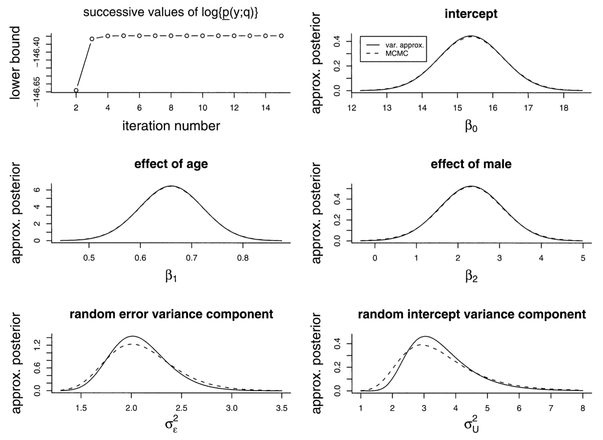
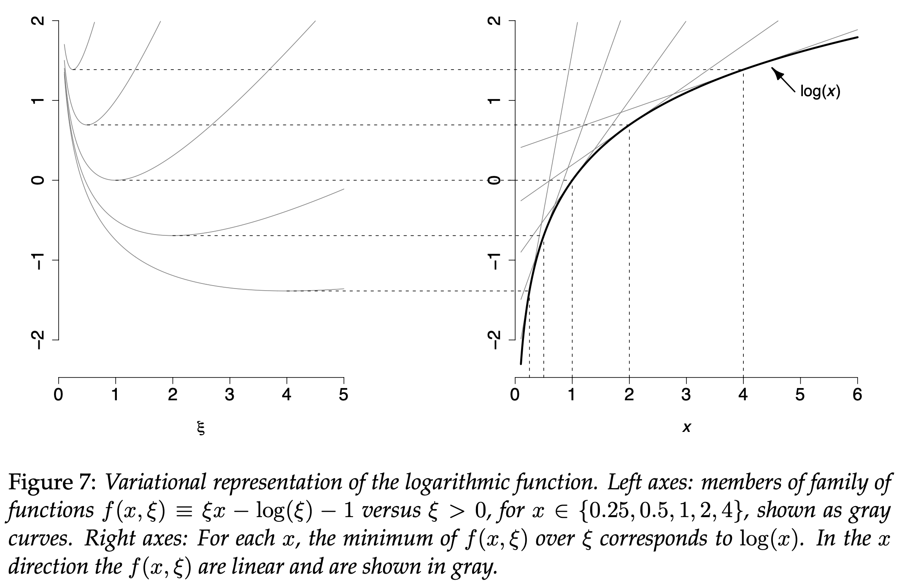

```{r setup, include=FALSE}
knitr::opts_chunk$set(echo = TRUE)
```

# Introduction

The article, "Explaining Variational Approximations", by J. T. Ormerod and M. P. Wand (*The American Statistician*, May 2010, Vol. 64, No. 2, pp.140-153), aims to import this inferential technique from the Computer Science community, where it is mainstream, to the Statistics community, where it is much less known.  Variational approximations abound in such applications as speech recognition, document retrieval, and genetic linkage analysis, but statisticians have long preferred Monte Carlo techniques or Laplace approximations.

The name derives from the mathematical topic of variational calculus, which the authors indicate, "is concerned with the problem of optimizing a functional over a class of functions on which that function depends. Approximate solutions arise when the class of functions is restricted in some way -- usually to enhance tractability." (Ormerod and Wand, 2010) In fact, the technique *does* make use of restrictions to enhance tractability, as the authors detail later in the article.

"Variational approximations is a body of deterministic techniques for making approximate inference for parameters in complex statistical models." (Ormerod and Wand, 2010) Often the problem involves Bayesian inference, and the goal is to approximate posterior densities. In fact, use cases outside of the Bayesian realm are rare. The technique is often applicable to the same types of problems as Markov Chain Monte Carlo (MCMC) but is much faster than MCMC and provides a richer class of methods than Laplace approximation. That said, its biggest con is that its accuracy is limited. In MCMC, one can often tune the accuracy of an approximation by simply increasing the sample size, but variational approximation does not work this way; the accuracy achieved cannot be improved without deriving a different algorithm.

The authors' objective is to explain variational approximation in statistical terms, and they focus on two overarching approaches, the Density Transform and the Tangent Transform. We will follow the same structure in our review of the article, assessing whether the authors were successful in their aims. Note that all equations and figures are from the original article.


# Density Transform Approach

The Density Transform Approach is one of two main approaches to variational approximations. It attempts to approximate Bayesian posterior densities by other densities ($q(\boldsymbol{\theta})$) for which a more tractable expression is found. There are two main restriction placed on the approximating density, the *Product Density Transform* and the  *Parametric Density Transform*. The product density approach is non-parametric and sees $q(\boldsymbol{\theta})$ factorized into $\prod^M_{i=1}q_i(\theta_i)$ for some partition $\{\boldsymbol{\theta}_i,...,\boldsymbol{\theta}_m\}$ of $\boldsymbol{\theta}$ (the parameter space). The parametric density approach involves selecting a well known and easily dealt with density in an attempt to make the posterior density more tractable. Both of these restrictions are guided by minimization of the Kullback-Leibler Divergence (Distance). 


## Kullback-Leibler Divergence

The Kullback-Leibler Divergence (K-L) measures the distance between one density and another. The authors show it is guaranteed that the log of the marginal likelihood satisfies
$$
\log(p(\boldsymbol{y})) \geq \int q(\boldsymbol{\theta})\log\left\{\frac{p(\boldsymbol{y},\boldsymbol{\theta})}{q(\boldsymbol{\theta})}\right\}d\boldsymbol{\theta}.
$$
This arises from the fact that
$$
\begin{array}{c}
\int q(\boldsymbol{\theta})\log\left\{\frac{q(\boldsymbol{\theta})}{p(\boldsymbol{\theta} \mid \boldsymbol{y})}\right\}d\boldsymbol{\theta} \ge 0 
\end{array}
$$
for all densities $q$, with equality if and only if $q(\boldsymbol{\theta})=p(\boldsymbol{\theta \mid y})$ almost everywhere.
The integral above is the K-L. It follows immediately that $p(\boldsymbol{y}) \geq \underline{p}(\boldsymbol{y};q)$, where
$$
\underline{p}(\boldsymbol{y};q) \equiv \int q(\boldsymbol{\theta})\log\left\{\frac{p(\boldsymbol{y},\boldsymbol{\theta})}{q(\boldsymbol{\theta})}\right\}d\boldsymbol{\theta}
$$
is the lower bound on the marginal likelihood which will be maximized approximate $q(\boldsymbol{\theta})$. 


## Product Density Transform

The authors first explore the first of the two Density Transform restrictions, the product restriction. This is the heart of their article. They devote four examples and more than half of the article's page count to the Product Density Transform. As a reminder, the product restriction on $q$ involves factorizing $q(\boldsymbol{\theta})$ into $\prod_{i=1}^M q_i(\boldsymbol{\theta}_i)$, for some partition $\{\boldsymbol{\theta}_1,\ldots,\boldsymbol{\theta}_M\}$ of $\boldsymbol{\theta}$. It can be shown that the optimal densities satisfy 
$$
q_{i}^{*}\left(\boldsymbol{\theta}_{i}\right) \propto \exp \left\{E_{-\boldsymbol{\theta}_{i}} \log p(\mathbf{y}, \boldsymbol{\theta})\right\}, \quad 1 \leq i \leq M,
$$
where $E_{-\boldsymbol{\theta}_i}$ denotes the expectation of the density with $q_i$ removed. This leads to Algorithm 1 below to solve for the $q_i^*$.
$$
\begin{array}{l}
\textbf{Algorithm 1}\text {  Iterative scheme for obtaining the optimal densities} \\
\text {under product density restriction. The updates are based on the} \\
\text {solutions given on the previous slide.} \\
\hline \text { Initialize: } q_{2}^{*}\left(\boldsymbol{\theta}_{2}\right), \ldots, q_{M}^{*}\left(\boldsymbol{\theta}_{M}\right) . \\
\text { Cycle: } \\
\qquad \begin{array}{c}
q_{1}^{*}\left(\boldsymbol{\theta}_{1}\right) \leftarrow \frac{\exp \left\{E_{-\boldsymbol{\theta}_{1}} \log p(\mathbf{y}, \boldsymbol{\theta})\right\}}{\int \exp \left\{E_{-\boldsymbol{\theta}_{1}} \log p(\mathbf{y}, \boldsymbol{\theta})\right\} d \boldsymbol{\theta}_{1}}, \\
\vdots \\
q_{M}^{*}\left(\boldsymbol{\theta}_{M}\right) \leftarrow \frac{\exp \left\{E_{-\boldsymbol{\theta}_{M}} \log p(\mathbf{y}, \boldsymbol{\theta})\right\}}{\int \exp \left\{E_{-\boldsymbol{\theta}_{M}} \log p(\mathbf{y}, \boldsymbol{\theta})\right\} d \boldsymbol{\theta}_{M}}
\end{array} \\
\text { until the increase in } \underline{p}(\mathbf{y} ; q) \text { is negligible. }
\end{array}
$$
In this generic form, there are $M$ partions of the parameter space and $M$ associated $q_i^*$s. All but one are given initial values, and then each is in turn updated using the values of the others. Once a complete cycle of updates is completed, the change in the lower bound is checked. If the increase is negligible, convergence has been achieved, and the algorithm is stopped. Otherwise, the cycle is repeated. The lower bound is only checked after completion of each *complete* cycle.

The authors indicate that it can be shown that convergence to at least local optima is guaranteed. They also point out that, if conjugate priors are used, the $q_i^*$ updates reduce to simply updating the parameters of a density family.  Finally, from the Computer Science realm, it is common to monitor convergence using $\text{log }\underline{p}(\boldsymbol{y};q)$ rather than the lower bound itself (without the $\log$).

The Product Density Transform has a notable connection to Gibbs sampling. An alternative expression for the $q_i^*$ is 
$$
q_{i}^{*}\left(\boldsymbol{\theta}_{i}\right) \propto \exp \left\{E_{-\boldsymbol{\theta}_{i}} \log p\left(\boldsymbol{\theta}_{i} \mid \text {rest}\right)\right\}
$$
$$
\text{rest} \equiv \left\{\mathbf{y}, \boldsymbol{\theta}_{1}, \ldots, \boldsymbol{\theta}_{i-1}, \boldsymbol{\theta}_{i+1}, \ldots, \boldsymbol{\theta}_{M}\right\}.
$$
The distributions $\boldsymbol{\theta}_{i} \mid \text {rest}$ are called *full conditionals* in Markov Chain Monte Carlo (MCMC), and Gibbs sampling is based around using repeated draws from them. In fact, the authors note that Product Density Transforms and Gibbs sampling are tractable for the same sorts of problems.

As mentioned earlier, the authors devote four examples to illustrating the Product Density Transform, but we will only discuss the first two in this review.


### Product Density Transform Example 1: Normal Random Sample

The objective of the first example is to approximate Bayesian inference for a random sample from a Normal distribution, a fairly straightforward problem that, in fact, possesses a closed-form solution. The distribution is
$$
X_{i} \mid \mu, \sigma^{2} \stackrel{\text { ind. }}{\sim} N\left(\mu, \sigma^{2}\right)
$$
with conjugate priors
$$
\mu \sim N\left(\mu_{\mu}, \sigma_{\mu}^{2}\right) \quad \text { and } \quad \sigma^{2} \sim \operatorname{IG}(A, B).
$$
With only two parameters, there is only one option for partitioning the parameter space. As a result, the product density transform approximation of $p(\mu,\sigma^2\mid\boldsymbol{x})$ is 
$$
q\left(\mu, \sigma^{2}\right)=q_{\mu}(\mu) q_{\sigma^{2}}\left(\sigma^{2}\right).
$$
From the generic derivation in the previous section, the optimal densities take the form
$$
q_{\mu}^{*}(\mu) \propto \exp \left[E_{\sigma^{2}}\left\{\log p\left(\mu \mid \sigma^{2}, \mathbf{x}\right)\right\}\right] \quad \text{and}
$$
$$
q_{\sigma^{2}}^{*}\left(\sigma^{2}\right) \propto \exp \left[E_{\mu}\left\{\log p\left(\sigma^{2} \mid \mu, \mathbf{x}\right)\right\}\right].
$$
The authors proceed to derive the estimates as
$$
q_{\sigma^2}^*(\sigma^2)\text{ is InverseGamma}\left(A+\frac{n}{2}, B+\frac{1}{2} E_{\mu}\left\|\mathbf{x}-\mu \mathbf{1}_{n}\right\|^{2}\right), \quad \text{ and}
$$
$$
q_{\mu}^{*}(\mu) \text { is Normal}\left(\frac{n \bar{X} E_{\sigma^{2}}\left(1 / \sigma^{2}\right)+\mu_{\mu} / \sigma_{\mu}^{2}}{n E_{\sigma^{2}}\left(1 / \sigma^{2}\right)+1 / \sigma_{\mu}^{2}}, \frac{1}{n E_{\sigma^{2}}\left(1 / \sigma^{2}\right)+1 / \sigma_{\mu}^{2}}\right).
$$
They derive the lower bound to be
$$
\begin{aligned}
\log \underline{p}(\boldsymbol{x} ; q)=& \frac{1}{2}-\frac{n}{2} \log (2 \pi)+\frac{1}{2} \log \left(\sigma_{q(\mu)}^{2} / \sigma_{\mu}^{2}\right) \\
&-\frac{\left(\mu_{q(\mu)}-\mu_{\mu}\right)^{2}+\sigma_{q(\mu)}^{2}}{2 \sigma_{\mu}^{2}} +A \log (B)\\
&-\left(A+\frac{n}{2}\right) \log \left(B_{q\left(\sigma^{2}\right)}\right)+\log \Gamma\left(A+\frac{n}{2}\right)-\log \Gamma(A).
\end{aligned}
$$
This leads to Algorithm 2 below.
$$
\begin{array}{l}
\textbf{Algorithm 2}\text{ Iterative scheme for obtaining the parameters} \\
\text{in the optimal densities } q_{\mu}^{*} \text{ and } q_{\sigma^{2}}^{*} \text{ in the Normal random} \\
\text{sample example.} \\
\hline \text{ Initialize: } B_{q\left(\sigma^{2}\right)}>0 \\
\text{ Cycle: } \\
\qquad \begin{array}{c}
\sigma_{q(\mu)}^{2} \leftarrow\left\{n\left(A+\frac{n}{2}\right) / B_{q\left(\sigma^{2}\right)}+1 / \sigma_{\mu}^{2}\right\}^{-1}, \\
\mu_{q(\mu)} \leftarrow\left\{n \bar{X}\left(A+\frac{n}{2}\right) / B_{q\left(\sigma^{2}\right)}+\mu_{\mu} / \sigma_{\mu}^{2}\right\} \sigma_{q(\mu)}^{2}, \\
B_{q\left(\sigma^{2}\right)} \leftarrow B+\frac{1}{2}\left(\left\|\mathbf{x}-\mu_{q(\mu)} \mathbf{1}_{n}\right\|^{2}+n \sigma_{q(\mu)}^{2}\right)\\
\end{array} \\
\text{ until the increase in } \underline{p}(\mathbf{x} ; q) \text{ is negligible.}
\end{array}
$$
$B_{q\left(\sigma^{2}\right)}$, a parameter of the Inverse Gamma distribution, is the only parameter that must be initialized. One cycle involves updating, in succession, $\sigma_{q(\mu)}^{2}$, $\mu_{q(\mu)}$, and $B_{q\left(\sigma^{2}\right)}$ before checking the lower bound for convergence. Once that convergence is achieved, the posterior densities are approximated as
$$
p(\mu \mid \boldsymbol{x}) \approx\left\{2 \pi\left(\sigma_{q(\mu)}^{2}\right)^{*}\right\}^{-1 / 2} \exp \left[-\left(\mu-\mu_{q(\mu)}^{*}\right)^{2} /\left\{2\left(\sigma_{q(\mu)}^{2}\right)^{*}\right\}\right] \quad \text{ and}
$$
$$
p\left(\sigma^{2} \mid \boldsymbol{x}\right) \approx \frac{\left(B_{q\left(\sigma^{2}\right)}^{*}\right)^{A+\frac{n}{2}}}{\Gamma\left(A+\frac{n}{2}\right)}\left(\sigma^{2}\right)^{-A-\frac{n}{2}-1} \exp \left(B_{q\left(\sigma^{2}\right)}^{*} / \sigma^{2}\right), \quad \sigma^{2}>0.
$$
They are Normal and Inverse Gamma, as expected given that the authors used conjugate priors.

The authors next tested this Product Density variational approximation by simulating data of sample size $n=20$ from a $N(100,225)$ distribution. They chose vague priors of $\mu \sim N(0,10^8)$ and $\sigma^2 \sim IG(\frac{1}{100},\frac{1}{100})$ and an initial value of $B_{q(\sigma^2)}=1$. The plots below compare the variational approximation against the exact posterior density. (Again, this simple example has a closed-form solution, making this possible).
```{r echo=FALSE, out.width='100%', fig.align='center'}
knitr::include_graphics('Figure2.png')
```
From the leftmost plot, it is clear that convergence is very rapid. The $\log$ of the lower bound is essentially maximized by iteration 2! From the other two plots, one can see the accuracy of variational approximation (the solid lines) is quite close to the exact posterior densities (dashed lines).


### Product Density Transform Example 2: Linear Mixed Model

The objective of the authors' second example is to approximate Bayesian inference for a random sample from a Gaussian linear mixed model, distributed as
$$
\boldsymbol{y}|\boldsymbol{\beta}, \boldsymbol{u}, \boldsymbol{G}, \boldsymbol{R} \sim N(\boldsymbol{X} \boldsymbol{\beta}+\boldsymbol{Z} \boldsymbol{u}, \boldsymbol{R}), \quad \boldsymbol{u}| \boldsymbol{G} \sim N(\mathbf{0}, \boldsymbol{G}),
$$
where 
$$
\begin{array}{l}
\boldsymbol{y}\text{ is the }n \times 1\text{ response,} \\
\boldsymbol{\beta}\text{ is the }p \times 1\text{ fixed effects,} \\
\boldsymbol{u}\text{ is the random effects,} \\
\boldsymbol{X}\text{ and }\boldsymbol{Z}\text{ are design matrices,} \\
\boldsymbol{G}\text{ and }\boldsymbol{R}\text{ are covariance matrices,} \\
\end{array}
$$
and the conjugate priors are
$$
\boldsymbol{\beta} \sim N\left(\mathbf{0}, \sigma_{\beta}^{2} \boldsymbol{I}\right), \quad \sigma_{u \ell}^{2} \sim \operatorname{IG}\left(A_{u \ell}, B_{u \ell}\right), 1 \leq \ell \leq r, \quad \sigma_{\varepsilon}^{2} \sim \mathrm{IG}\left(A_{\varepsilon}, B_{\varepsilon}\right).
$$

In this case, the authors find the two-component product transform to be
$$
q\left(\boldsymbol{\beta}, \boldsymbol{u}, \sigma_{u 1}^{2}, \ldots, \sigma_{u r}^{2}, \sigma_{\varepsilon}^{2}\right)=q_{\boldsymbol{\beta}, \boldsymbol{u}}(\boldsymbol{\beta}, \boldsymbol{u}) q_{\boldsymbol{\sigma}^{2}}\left(\sigma_{u 1}^{2}, \ldots, \sigma_{u r}^{2}, \sigma_{\varepsilon}^{2}\right)
$$
This leads to the optimal densities
$$q_{\boldsymbol{\beta},\boldsymbol{u}}^*({\boldsymbol{\beta},\boldsymbol{u}})\text{ is a Multivariate Normal density, }\quad\text{ and}$$
$$q_{\boldsymbol{\sigma^2}}^*\text{ is a product of r+1 Inverse Gamma densities.}$$
The authors are quick to point out that these resultant densities are *not* preimposed but rather are an outgrowth of the distribution and the careful choice of factorization for the product restriction. The lower bound is in turn derived to be
$$
\begin{array}{l}
\log \underline{p}(\mathbf{y} ; q) \\
=\frac{1}{2}\left(p+\sum_{\ell=1}^{r} K_{\ell}\right)-\frac{n}{2} \log (2 \pi)-\frac{p}{2} \log \left(\sigma_{\beta}^{2}\right) \\
\quad+\frac{1}{2} \log \left|\boldsymbol{\Sigma}_{q(\boldsymbol{\beta}, \mathbf{u})}\right|-\frac{1}{2 \sigma_{\beta}^{2}}\left\{\left\|\boldsymbol{\mu}_{q(\boldsymbol{\beta})}\right\|^{2}+\operatorname{tr}\left(\boldsymbol{\Sigma}_{q(\boldsymbol{\beta})}\right)\right\} \\
\quad+A_{\mathcal{\varepsilon}} \log \left(B_{\varepsilon}\right)-\left(A_{\varepsilon}+\frac{n}{2}\right) \log \left(B_{q\left(\sigma_{\varepsilon}^{2}\right)}\right) \\
\quad+\log \Gamma\left(A_{\varepsilon}+\frac{n}{2}\right)-\log \Gamma\left(A_{\varepsilon}\right) \\
\quad+\sum_{\ell=1}^{r}\left\{A_{u \ell} \log \left(B_{u \ell}\right)-\left(A_{u \ell}+\frac{K_{\ell}}{2}\right) \log \left(B_{q\left(\sigma_{u \ell}^{2}\right)}\right)\right. \\
\left.\quad+\log \Gamma\left(A_{u \ell}+\frac{K_{\ell}}{2}\right)-\log \Gamma\left(A_{u \ell}\right)\right\}.
\end{array}
$$
This leads to Algorithm 3 below.
$$
\begin{array}{l}
\textbf{Algorithm 3}\text{ Iterative scheme for obtaining the parameters in the} \\
\text{optimal densities } q_{\boldsymbol{\beta}, \boldsymbol{u}}^{*} \text{ and } q_{\boldsymbol{\sigma}^{2}}^{*} \text{ in the Bayesian linear mixed model example.} \\
\hline \text{ Initialize: } B_{q\left(\sigma_{\varepsilon}^{2}\right)}, B_{q\left(\sigma_{u 1}^{2}\right)}, \ldots, B_{q\left(\sigma_{u r}^{2}\right)}>0 \\
\text{ Cycle: } \\
\qquad \begin{array}{l}
\begin{aligned}
\boldsymbol{\Sigma}_{q(\boldsymbol{\beta}, \mathbf{u})} \leftarrow\left\{\frac { A _ { \varepsilon } + \frac { n } { 2 } } { B _ { q ( \sigma _ { \varepsilon } ^ { 2 } ) } } \mathbf { C } ^ { T } \mathbf { C } + \text { blockdiag } \left(\sigma_{\beta}^{-2} \mathbf{I}_{p}, \frac{A_{u 1}+\frac{1}{2} K_{1}}{B_{q\left(\sigma_{u 1}^{2}\right)}} \mathbf{I}_{K_{1}}, \ldots,\right.\right.\\
\left.\left.\frac{A_{u r}+\frac{1}{2} K_{r}}{B_{q\left(\sigma_{u r}^{2}\right)}} \mathbf{I}_{K_{r}}\right)\right\}^{-1}
\end{aligned}\\
\boldsymbol{\mu}_{q(\boldsymbol{\beta}, \mathbf{u})} \leftarrow\left(\frac{A_{\varepsilon}+\frac{n}{2}}{B_{q\left(\sigma_{\varepsilon}^{2}\right)}}\right) \boldsymbol{\Sigma}_{q(\boldsymbol{\beta}, \mathbf{u})} \mathbf{C}^{T} \mathbf{y} \\
B_{q\left(\sigma_{\varepsilon}^{2}\right)} \leftarrow B_{\varepsilon}+\frac{1}{2}\left\{\left\|\mathbf{y}-\mathbf{C} \boldsymbol{\mu}_{q(\boldsymbol{\beta}, \mathbf{u})}\right\|^{2}+\operatorname{tr}\left(\mathbf{C}^{T} \mathbf{C} \boldsymbol{\Sigma}_{q(\boldsymbol{\beta}, \mathbf{u})}\right)\right\} \\
B_{q\left(\sigma_{u \ell}^{2}\right)} \leftarrow B_{u \ell}+\frac{1}{2}\left\{\left\|\boldsymbol{\mu}_{q\left(\mathbf{u}_{\ell}\right)}\right\|^{2}+\operatorname{tr}\left(\boldsymbol{\Sigma}_{q}\left(\mathbf{u}_{\ell}\right)\right)\right\} \quad \text { for } 1 \leq \ell \leq r
\end{array} \\
\text{ until the increase in } \underline{p}(\mathbf{x} ; q) \text{ is negligible.}
\end{array}
$$
This time, $r+1$ Inverse Gamma parameters must be initialized at the start of the algorithm, and the math is more complex, but the basic structure is the same as in the first example. Upon convergence, the posterior densities are approximated as
$$
\begin{array}{l}
p(\boldsymbol{\beta}, \mathbf{u} \mid \mathbf{y}) \approx \text { the } N\left(\boldsymbol{\mu}_{q(\boldsymbol{\beta}, \mathbf{u})}^{*}, \boldsymbol{\Sigma}_{q(\boldsymbol{\beta}, \mathbf{u})}^{*}\right) \text { density function, } \quad \text{ and} \\ \\
p\left(\sigma_{u 1}^{2}, \ldots, \sigma_{u r}^{2}, \sigma_{\varepsilon}^{2} \mid \boldsymbol{y}\right) \approx \\
\quad \text { a product of the }\mathrm{IG}\left(A_{u \ell}+\frac{1}{2} K_{\ell}, B_{q\left(\sigma_{u \ell}^{2}\right)}^{*}\right), 1 \leq \ell \leq r, \text { density functions}\\
\quad \text { together with the } \mathrm{IG}\left(A_{\varepsilon}+\frac{1}{2} n, B_{q\left(\sigma_{\varepsilon}^{2}\right)}^{*}\right) \text { density function.}
\end{array}
$$

Because this example has no closed-form solution, the authors test the algorithm on real world data.  They used a data set consisting of longitudinal orthodontic measurements and set up a random intercept model as follows:
$$
\begin{array}{l}
\text {distance }_{i j} \mid U_{i} \stackrel{\text { ind. }}{\sim} N\left(\beta_{0}+U_{i}+\beta_{1} \text { age }_{i j}+\beta_{2} \operatorname{male}_{i}, \sigma_{\varepsilon}^{2}\right), \\
U_{i} \mid \sigma_{u}^{2} \stackrel{\text { ind. }}{\sim} N\left(0, \sigma_{u}^{2}\right), \quad 1 \leq i \leq 27,1 \leq j \leq 4, \\
\beta_{i} \stackrel{\text { ind. }}{\sim} N\left(0, \sigma_{\beta}^{2}\right), \quad \sigma_{u}^{2}, \sigma_{\varepsilon}^{2} \stackrel{\text { ind }}{\sim} \mathrm{IG}(A, B).
\end{array}
$$
They again chose vague priors of $\sigma^2_\beta = 10^8$ and $A=B=\frac{1}{100}$. With no closed form theoretical answer to compare against, the authors chose as a proxy the kernel density estimates generated from one million MCMC samples.
```{r echo=FALSE, out.width='80%', fig.align='center'}

```
Once again, the upper left plot highlights how rapidly the variational approximation converges, and the other five plots speak to its accuracy. Statistical significance was achieved for all parameters within 10-15 iterations of the Product Density Transform variational approximation. While the number of MCMC samples was chosen to be especially high in order to stand in for a non-existent closed-form solution, even a more aggressive MCMC estimate would have used thousands, tens of thousands, or hundreds of thousands of iterations. It is easy to see why computer scientists may gravitate to the zippy variational approximation instead!

The authors then walk through two more examples of the Product Density Transform, a Probit regression using auxiliary variables to make the solution tractable and a finite Normal mixture model. Interested readers can refer to the original article to learn more about these examples.


## Parametric Density Transform

The second type of restriction used in the Density Transform Approach is the parametric restriction, which selects a distribution $q(\boldsymbol{\theta})$ that belongs to a known parametric family in an attempt to achieve a more tractable posterior density. This is best shown in the next example. 

### Parametric Density Transform Example: Poisson Regression

The example from the authors is a Poisson Regression with a Gaussian Transform, where the Bayesian Poisson regression model is given by
$$
Y_i|\beta_0...\beta_k \sim Poisson(exp(\beta_0+\beta_1x_{1i}+...+\beta_1x_{ki})),
$$
with the prior distributions on the coefficient vector of $\boldsymbol{\beta} \sim N(\boldsymbol{\mu_\beta},\boldsymbol{\Sigma_\beta})$.

In this case, the marginal likelihood contains an integral that is intractable:
$$
\begin{array}{l}
p(\boldsymbol{y})= (2\pi)^{-(k+1)/2}|\boldsymbol{\Sigma_\beta}|^{-1/2} \\
\quad\quad\times\int_{\mathbb{R}^{k+1}}\exp\left\{\boldsymbol{y}^T\boldsymbol{X\beta}-\boldsymbol{I}_n^T exp(\boldsymbol{X\beta})-\boldsymbol{I}^T_n\log(\boldsymbol{y}!) \right. \\
\left. \quad\quad-\frac{1}{2}\left(\boldsymbol{\beta-\mu_\beta}\right)^T\boldsymbol{\Sigma_\beta}^{-1}\left(\boldsymbol{\beta-\mu_\beta}\right)\right\}d\boldsymbol{\beta}
\end{array}
$$

To get around this, the authors selected the Normal distribution $q \sim N(\boldsymbol{\mu}_{q(\boldsymbol{\beta})},\boldsymbol{\Sigma}_{q(\boldsymbol{\beta})})$ for the Parametric Density Transform. Written out in full, 
$$
\begin{array}{l}
q(\boldsymbol{\beta};\boldsymbol{\mu}_{q(\boldsymbol{\beta})},\boldsymbol{\Sigma}_{q(\boldsymbol{\beta})}) \\
\quad=(2\pi)^{-p/2}|\boldsymbol{\Sigma}_{q(\boldsymbol{\beta})}|^{-1/2}\exp\left\{-\frac{1}{2}(\boldsymbol{\beta}-\boldsymbol{\mu}_{q(\boldsymbol{\beta})})^T \boldsymbol{\Sigma}_{q(\boldsymbol{\beta})}^{-1} (\boldsymbol{\beta}-\boldsymbol{\mu}_{q(\boldsymbol{\beta})})\right\}.
\end{array}
$$
Then the lower bound used to minimize the K-L divergence is
$$
\begin{aligned}
\log \underline{p} &\left(\mathbf{y} ; \boldsymbol{\mu}_{q(\boldsymbol{\beta})}, \boldsymbol{\Sigma}_{q(\boldsymbol{\beta})}\right) \\
&= \mathbf{y}^{T} \mathbf{X} \boldsymbol{\mu}_{q(\boldsymbol{\beta})}-\mathbf{1}_{n}^{T} \exp \left\{\mathbf{X} \boldsymbol{\mu}_{q(\boldsymbol{\beta})}+\frac{1}{2} \operatorname{diagonal}\left(\mathbf{X} \boldsymbol{\Sigma}_{q(\boldsymbol{\beta})} \mathbf{X}^{T}\right)\right\} \\
&-\frac{1}{2}\left(\boldsymbol{\mu}_{q(\boldsymbol{\beta})}-\boldsymbol{\mu}_{\boldsymbol{\beta}}\right)^{T} \boldsymbol{\Sigma}_{\boldsymbol{\beta}}^{-1}\left(\boldsymbol{\mu}_{q(\boldsymbol{\beta})}-\boldsymbol{\mu}_{\boldsymbol{\beta}}\right)-\frac{1}{2} \operatorname{tr}\left(\boldsymbol{\Sigma}_{\boldsymbol{\beta}}^{-1} \boldsymbol{\Sigma}_{q(\boldsymbol{\beta})}\right) \\
&+\frac{1}{2} \log \left|\boldsymbol{\Sigma}_{q(\boldsymbol{\beta})}\right|-\frac{1}{2} \log \left|\boldsymbol{\Sigma}_{\boldsymbol{\beta}}\right|+\frac{k+1}{2} -\mathbf{1}_{n}^{T} \log (\mathbf{y} !).
\end{aligned}
$$

From earlier discussions it is guaranteed that 
$$
\log p(\boldsymbol{y}) \geq \log \underline{p}(\boldsymbol{y}; \boldsymbol{\mu}_{q(\boldsymbol{\beta})}, \boldsymbol{\Sigma}_{q(\boldsymbol{\beta)}}),
$$
where the optimal variational parameters can be found through maximizing the above inequality using Newton-Raphson iteration. The obtained parameters minimize the K-L divergence and provide the optimal Gaussian density transform $q*$ as  $N(\boldsymbol{\mu}^*_{q(\boldsymbol{\beta})},\boldsymbol{\Sigma}_{q(\boldsymbol{\beta})}^*)$. Note that, aside from Newton-Raphson, this approach does not require the type of iterative algorithm seen for the Product Density Transform.


# Tangent Transform Approach 

The authors point out that not all variational approximations fit into the Kullback-Leibler Divergence framework. For some of these use cases, a Tangent Transform approach may apply. This approach utilizes *tangent-type* representations of concave/convex functions. The overall approach is underpinned by theory of convex duality, which is not elaborated on in the article. An example representation is given by
$$
\log (x)=\min _{\xi>0}\{\xi x-\log (\xi)-1\}, \quad \text { for all } x>0.
$$
This representation implies
$$
\log(x) \leq \xi x - \log(\xi)-1, \quad \text{ for all } \xi > 0.
$$

The fact that the representation is linear in x for every value of $\xi > 0$ allows for simplification of expressions involving the log function. The following figure (taken from the article with caption intact for reference) illustrates this relationship. Notice how for a given $x$ value (right graph) on the logarithmic curve, the tangential point on the tangent line corresponds to a specific minimum on the left graph for a corresponding plot relative to $\xi$. The example that follows demonstrates how to use this approach. 

```{r echo=FALSE, out.width='95%', fig.align='center'}

```

## Tangent Transform Approach Example: Bayesian Logistic Regression

The authors state that Bayesian logistic regression lends itself to the Tangent Transform, but do not detail why. We ascertain from the derived equations that it is due to the posterior density's form containing terms similar to the tangent-type form specified earlier. Given the Bayesian logistic regression model
$$
Y_i|\beta_0,...,\beta_k \stackrel{\text { ind. }}{\sim} \text{Bernoulli}\left([1+\exp\left\{-(\beta_0+\beta_1x_{1i}+...+\beta_kx_{ki}\right\}]^{-1}\right),
$$
with priors on the coefficient vector of $\boldsymbol{\beta} \sim N(\boldsymbol{\mu_\beta},\boldsymbol{\Sigma_\beta})$, the posterior density of $\boldsymbol{\beta}$ is
$$
\left. p(\boldsymbol{\beta}\mid\boldsymbol{y})=p(\boldsymbol{y},\boldsymbol{\beta}) \middle/ \int_ {\mathbb{R}^{k+1}}p(\boldsymbol{y},\boldsymbol{\beta})d\boldsymbol{\beta} \right.,
$$
where the denominator contains an intractable integral, and $p(\boldsymbol{y},\boldsymbol{\beta})$ is
$$
\begin{array}{l}
p(\boldsymbol{y},\boldsymbol{\beta}) = \exp\left[\boldsymbol{y}^T\boldsymbol{X\beta} -\boldsymbol{1}_n^T \log\left\{\boldsymbol{1}_n+\exp(\boldsymbol{X\beta})\right\} \right.
\\ \quad\quad\left. -\frac{1}{2}(\boldsymbol{\beta}-\boldsymbol{\mu_\beta})^T \boldsymbol{\Sigma_\beta}^{-1} (\boldsymbol{\beta}-\boldsymbol{\mu_\beta})
-\frac{k+1}{2}\log(2\pi)-\frac{1}{2}\log|\boldsymbol{\Sigma_\beta}|\right].
\end{array}
$$

Note the expression above contains a term that can be used for the tangent transform, isolated below for clarity:
$$
-\boldsymbol{1}_n^T \log\left\{\boldsymbol{1}_n+\exp(\boldsymbol{X\beta})\right\}
$$
It can be shown that $-\log(1+e^x)$ (which has the same structure as the term above) is the maximum of a family of parabolas: 
$$
-\log \left(1+e^{x}\right)=\max _{\xi \in \mathbb{R}}\left\{A(\xi) x^{2}-\frac{1}{2} x+C(\xi)\right\} \quad \text { for all } x \in \mathbb{R},
$$
where $A(\xi) \text{ and } C(\xi)$ are functions of $\xi> 0$ detailed in the article. This equation is a *tangent-type* representation of a convex function. From here the derivation proceeds similarly to the previous examples. The only additional step is an optimization of the $\xi$ parameter, which can also be done via the Newton-Raphson method. 


# A Note on Frequentist Inference

Many of the authors' examples involved Bayesian inference, as they argue that frequentist problems rarely have as much to gain from variational approximation. In the Bayesian realm, as stated earlier, many posterior densities are intractable. However, the authors do provide a frequentist example for the curious reader in the form of a Poisson Mixed Model.


# Conclusion

The article's stated goal is to increase the statistician's familiarity with variational approximations, a tool popular in the field of Computer Science, and we feel they succeed in this regard, framing their discussions in terminology statistician's would understand. While the authors barely discuss the accuracy of this technique, they do cite other sources for those interested in that aspect. The authors believe variational approximations have the potential increasingly to become a major player, as new software is being released, and new methods are emerging continually. They also emphasize that their usefulness increases with problem size, where MCMC approaches begin to break down.
