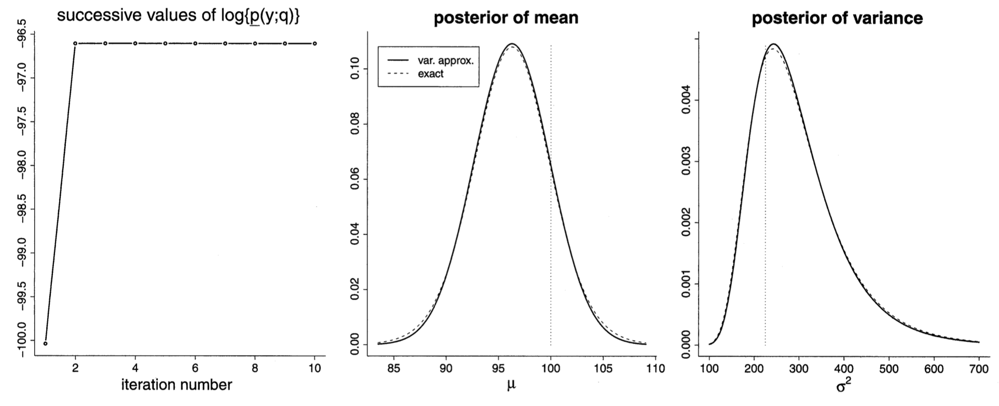
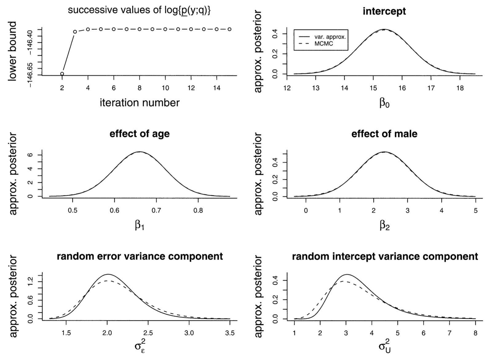
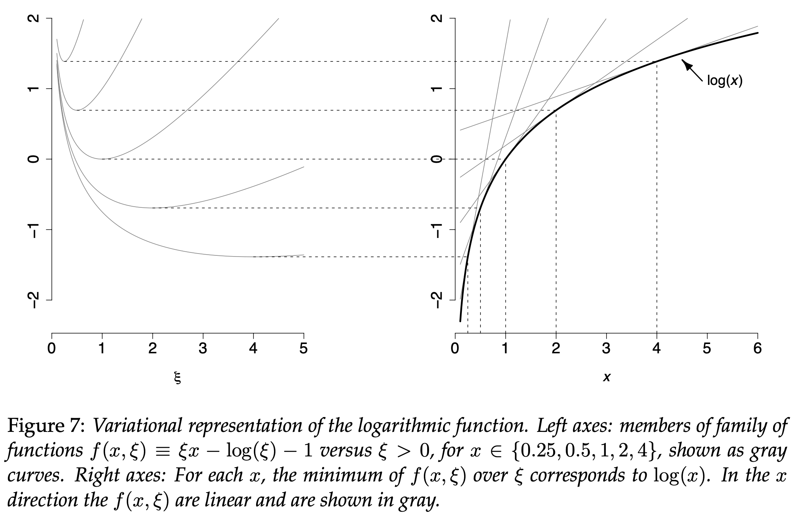

```{r setup, include=FALSE}
knitr::opts_chunk$set(echo = FALSE)
pacman::p_load(pacman)
```

## Outline

- Introduction
<p>&nbsp;</p>
- Density Transform Approach
<p>&nbsp;</p>
- Tangent Transform Approach
<p>&nbsp;</p>
- Conclusion

## Introduction
NEED STUFF HERE! VERY IMPORTANT!

## Density Transform Approach

- Approximates intractable posterior densities with better known and easier to deal with densities
- Guided by Kullback-Leibler divergence
$$\text{formula 2+3+4+ } p(y) > p(y;q)$$
  - provides a lower bound which can be maximized in order to minimize the k-l divergence between q and p(.|y)
- Two main types of restrictions for the $q$ density:
  + Product Density Transforms (non-parametric)
  + Parametric Density Transforms (parametric)

## Product Density Transforms

- Suppose $q$ is subject to the product restriction from the previous slide
- It can be shown that the optimal densities satisfy 
$$
q_{i}^{*}\left(\boldsymbol{\theta}_{i}\right) \propto \exp \left\{E_{-\boldsymbol{\theta}_{i}} \log p(\mathbf{y}, \boldsymbol{\theta})\right\}, \quad 1 \leq i \leq M
$$
where $E_{-\boldsymbol{\theta}_i}$ denotes the expectation of the density with $q_i$ removed
- This leads to the algorithm on the next slide to solve for the $q_i^*$
- Notes:
  + Can show that convergence to at least local optima guaranteed
  + If conjugate priors used, then the $q_i^*$ updates reduce to updating parameters in a density family
  + Common to monitor convergence using $\text{log }\underline{p}(\boldsymbol{y};q)$

## Product Density Transforms

$$
\begin{array}{l}
\textbf{Algorithm 1}\text {  Iterative scheme for obtaining the optimal densities} \\
\text {under product density restriction. The updates are based on the} \\
\text {solutions given on the previous slide.} \\
\hline \text { Initialize: } q_{2}^{*}\left(\boldsymbol{\theta}_{2}\right), \ldots, q_{M}^{*}\left(\boldsymbol{\theta}_{M}\right) . \\
\text { Cycle: } \\
\qquad \begin{array}{c}
q_{1}^{*}\left(\boldsymbol{\theta}_{1}\right) \leftarrow \frac{\exp \left\{E_{-\boldsymbol{\theta}_{1}} \log p(\mathbf{y}, \boldsymbol{\theta})\right\}}{\int \exp \left\{E_{-\boldsymbol{\theta}_{1}} \log p(\mathbf{y}, \boldsymbol{\theta})\right\} d \boldsymbol{\theta}_{1}}, \\
\vdots \\
q_{M}^{*}\left(\boldsymbol{\theta}_{M}\right) \leftarrow \frac{\exp \left\{E_{-\boldsymbol{\theta}_{M}} \log p(\mathbf{y}, \boldsymbol{\theta})\right\}}{\int \exp \left\{E_{-\boldsymbol{\theta}_{M}} \log p(\mathbf{y}, \boldsymbol{\theta})\right\} d \boldsymbol{\theta}_{M}}
\end{array} \\
\text { until the increase in } \underline{p}(\mathbf{y} ; q) \text { is negligible. }
\end{array}
$$

## Connection with Gibbs Sampling

- An alternative expression for the $q_i^*$ is 
$$
q_{i}^{*}\left(\boldsymbol{\theta}_{i}\right) \propto \exp \left\{E_{-\boldsymbol{\theta}_{i}} \log p\left(\boldsymbol{\theta}_{i} \mid \text {rest}\right)\right\}
$$
$$
\text{rest} \equiv \left\{\mathbf{y}, \boldsymbol{\theta}_{1}, \ldots, \boldsymbol{\theta}_{i-1}, \boldsymbol{\theta}_{i+1}, \ldots, \boldsymbol{\theta}_{M}\right\}
$$
- The distributions $\boldsymbol{\theta}_{i} \mid \text {rest}$ are called full conditionals in Markov Chain Monte Carlo
- Gibbs sampling uses repeated draws from these
- In fact, product density transforms and Gibbs are tractable in the same scenarios

## Product DT Example 1: Normal Random Sample

- Objective is to approximate Bayesian inference for a random sample from a Normal distribution
$$
X_{i} \mid \mu, \sigma^{2} \stackrel{\text { ind. }}{\sim} N\left(\mu, \sigma^{2}\right)
$$
with conjugate priors
$$
\mu \sim N\left(\mu_{\mu}, \sigma_{\mu}^{2}\right) \quad \text { and } \quad \sigma^{2} \sim \operatorname{IG}(A, B)
$$
- The product density transform approximation of $p(\mu,\sigma^2\mid\boldsymbol{x})$ is 
$$
q\left(\mu, \sigma^{2}\right)=q_{\mu}(\mu) q_{\sigma^{2}}\left(\sigma^{2}\right)
$$
- The optimal densities take the form
$$
q_{\mu}^{*}(\mu) \propto \exp \left[E_{\sigma^{2}}\left\{\log p\left(\mu \mid \sigma^{2}, \mathbf{x}\right)\right\}\right] \quad \text{and}
$$
$$
q_{\sigma^{2}}^{*}\left(\sigma^{2}\right) \propto \exp \left[E_{\mu}\left\{\log p\left(\sigma^{2} \mid \mu, \mathbf{x}\right)\right\}\right]
$$

## Product DT Example 1: Normal Random Sample

- The resulting estimates are:
$$
q_{\sigma^2}^*(\sigma^2)\text{ is InverseGamma}\left(A+\frac{n}{2}, B+\frac{1}{2} E_{\mu}\left\|\mathbf{x}-\mu \mathbf{1}_{n}\right\|^{2}\right)
$$
$$
q_{\mu}^{*}(\mu) \text { is Normal}\left(\frac{n \bar{X} E_{\sigma^{2}}\left(1 / \sigma^{2}\right)+\mu_{\mu} / \sigma_{\mu}^{2}}{n E_{\sigma^{2}}\left(1 / \sigma^{2}\right)+1 / \sigma_{\mu}^{2}}, \frac{1}{n E_{\sigma^{2}}\left(1 / \sigma^{2}\right)+1 / \sigma_{\mu}^{2}}\right)
$$
and
$$
\begin{aligned}
\log \underline{p}(\boldsymbol{x} ; q)=& \frac{1}{2}-\frac{n}{2} \log (2 \pi)+\frac{1}{2} \log \left(\sigma_{q(\mu)}^{2} / \sigma_{\mu}^{2}\right) \\
&-\frac{\left(\mu_{q(\mu)}-\mu_{\mu}\right)^{2}+\sigma_{q(\mu)}^{2}}{2 \sigma_{\mu}^{2}} +A \log (B)\\
&-\left(A+\frac{n}{2}\right) \log \left(B_{q\left(\sigma^{2}\right)}\right)+\log \Gamma\left(A+\frac{n}{2}\right)-\log \Gamma(A)
\end{aligned}
$$
- This leads to the algorithm on the next slide

## Product DT Example 1: Normal Random Sample

$$
\begin{array}{l}
\textbf{Algorithm 2}\text{ Iterative scheme for obtaining the parameters} \\
\text{in the optimal densities } q_{\mu}^{*} \text{ and } q_{\sigma^{2}}^{*} \text{ in the Normal random} \\
\text{sample example.} \\
\hline \text{ Initialize: } B_{q\left(\sigma^{2}\right)}>0 \\
\text{ Cycle: } \\
\qquad \begin{array}{c}
\sigma_{q(\mu)}^{2} \leftarrow\left\{n\left(A+\frac{n}{2}\right) / B_{q\left(\sigma^{2}\right)}+1 / \sigma_{\mu}^{2}\right\}^{-1}, \\
\mu_{q(\mu)} \leftarrow\left\{n \bar{X}\left(A+\frac{n}{2}\right) / B_{q\left(\sigma^{2}\right)}+\mu_{\mu} / \sigma_{\mu}^{2}\right\} \sigma_{q(\mu)}^{2}, \\
B_{q\left(\sigma^{2}\right)} \leftarrow B+\frac{1}{2}\left(\left\|\mathbf{x}-\mu_{q(\mu)} \mathbf{1}_{n}\right\|^{2}+n \sigma_{q(\mu)}^{2}\right)\\
\end{array} \\
\text{ until the increase in } \underline{p}(\mathbf{x} ; q) \text{ is negligible.}
\end{array}
$$

## Product DT Example 1: Normal Random Sample

- Upon convergence, the posterior densities are approximated as
$$
p(\mu \mid \boldsymbol{x}) \approx\left\{2 \pi\left(\sigma_{q(\mu)}^{2}\right)^{*}\right\}^{-1 / 2} \exp \left[-\left(\mu-\mu_{q(\mu)}^{*}\right)^{2} /\left\{2\left(\sigma_{q(\mu)}^{2}\right)^{*}\right\}\right]
$$
$$
p\left(\sigma^{2} \mid \boldsymbol{x}\right) \approx \frac{\left(B_{q\left(\sigma^{2}\right)}^{*}\right)^{A+\frac{n}{2}}}{\Gamma\left(A+\frac{n}{2}\right)}\left(\sigma^{2}\right)^{-A-\frac{n}{2}-1} \exp \left(B_{q\left(\sigma^{2}\right)}^{*} / \sigma^{2}\right), \quad \sigma^{2}>0
$$
- Next slide's plots compare product density variational approximations with exact posterior density
  + Sample size $n=20$ from $N(100,225)$
  + Vague priors chosen: $\mu \sim N(0,10^8),\ \sigma^2 \sim IG(\frac{1}{100},\frac{1}{100})$
  + Initial value $B_{q(\sigma^2)}=1$
  + Convergence very rapid, accuracy quite good

## Product DT Example 1: Normal Random Sample

```{r echo=FALSE, out.width='100%', fig.align='center'}

```

## Product DT Example 2: Linear Mixed Model

- Objective is to approximate Bayesian inference for a random sample from a Gaussian linear mixed model
$$
\boldsymbol{y}|\boldsymbol{\beta}, \boldsymbol{u}, \boldsymbol{G}, \boldsymbol{R} \sim N(\boldsymbol{X} \boldsymbol{\beta}+\boldsymbol{Z} \boldsymbol{u}, \boldsymbol{R}), \quad \boldsymbol{u}| \boldsymbol{G} \sim N(\mathbf{0}, \boldsymbol{G})
$$
where 
  + $\boldsymbol{y}$ is $n \times 1$ response, 
  + $\boldsymbol{\beta}$ is $p \times 1$ fixed effects, 
  + $\boldsymbol{u}$ is random effects,
  + $\boldsymbol{X}$ and $\boldsymbol{Z}$ are design matrices, and
  + $\boldsymbol{G}$ and $\boldsymbol{R}$ are covariance matrices
- Conjugate priors are
$$
\boldsymbol{\beta} \sim N\left(\mathbf{0}, \sigma_{\beta}^{2} \boldsymbol{I}\right), \quad \sigma_{u \ell}^{2} \sim \operatorname{IG}\left(A_{u \ell}, B_{u \ell}\right), 1 \leq \ell \leq r, \quad \sigma_{\varepsilon}^{2} \sim \mathrm{IG}\left(A_{\varepsilon}, B_{\varepsilon}\right)
$$

## Product DT Example 2: Linear Mixed Model

- The two-component product transform is
$$
q\left(\boldsymbol{\beta}, \boldsymbol{u}, \sigma_{u 1}^{2}, \ldots, \sigma_{u r}^{2}, \sigma_{\varepsilon}^{2}\right)=q_{\boldsymbol{\beta}, \boldsymbol{u}}(\boldsymbol{\beta}, \boldsymbol{u}) q_{\boldsymbol{\sigma}^{2}}\left(\sigma_{u 1}^{2}, \ldots, \sigma_{u r}^{2}, \sigma_{\varepsilon}^{2}\right)
$$
- This leads to optimal densities
$$q_{\boldsymbol{\beta},\boldsymbol{u}}^*({\boldsymbol{\beta},\boldsymbol{u}})\text{ is a Multivariate Normal density}$$
$$q_{\boldsymbol{\sigma^2}}^*\text{ is a product of $r+1$ Inverse Gamma densities}$$
and...

## Product DT Example 2: Linear Mixed Model

$$
\begin{array}{l}
\log \underline{p}(\mathbf{y} ; q) \\
=\frac{1}{2}\left(p+\sum_{\ell=1}^{r} K_{\ell}\right)-\frac{n}{2} \log (2 \pi)-\frac{p}{2} \log \left(\sigma_{\beta}^{2}\right) \\
\quad+\frac{1}{2} \log \left|\boldsymbol{\Sigma}_{q(\boldsymbol{\beta}, \mathbf{u})}\right|-\frac{1}{2 \sigma_{\beta}^{2}}\left\{\left\|\boldsymbol{\mu}_{q(\boldsymbol{\beta})}\right\|^{2}+\operatorname{tr}\left(\boldsymbol{\Sigma}_{q(\boldsymbol{\beta})}\right)\right\} \\
\quad+A_{\mathcal{\varepsilon}} \log \left(B_{\varepsilon}\right)-\left(A_{\varepsilon}+\frac{n}{2}\right) \log \left(B_{q\left(\sigma_{\varepsilon}^{2}\right)}\right) \\
\quad+\log \Gamma\left(A_{\varepsilon}+\frac{n}{2}\right)-\log \Gamma\left(A_{\varepsilon}\right) \\
\quad+\sum_{\ell=1}^{r}\left\{A_{u \ell} \log \left(B_{u \ell}\right)-\left(A_{u \ell}+\frac{K_{\ell}}{2}\right) \log \left(B_{q\left(\sigma_{u \ell}^{2}\right)}\right)\right. \\
\left.\quad+\log \Gamma\left(A_{u \ell}+\frac{K_{\ell}}{2}\right)-\log \Gamma\left(A_{u \ell}\right)\right\}
\end{array}
$$

- This leads to the algorithm on the next slide

$$
\begin{array}{l}
\textbf{Algorithm 3}\text{ Iterative scheme for obtaining the parameters in the} \\
\text{optimal densities } q_{\boldsymbol{\beta}, \boldsymbol{u}}^{*} \text{ and } q_{\boldsymbol{\sigma}^{2}}^{*} \text{ in the Bayesian linear mixed model example.} \\
\end{array}
$$

## Product DT Example 2: Linear Mixed Model

$$
\begin{array}{l}
\hline \text{ Initialize: } B_{q\left(\sigma_{\varepsilon}^{2}\right)}, B_{q\left(\sigma_{u 1}^{2}\right)}, \ldots, B_{q\left(\sigma_{u r}^{2}\right)}>0 \\
\text{ Cycle: } \\
\qquad \begin{array}{l}
\begin{aligned}
\boldsymbol{\Sigma}_{q(\boldsymbol{\beta}, \mathbf{u})} \leftarrow\left\{\frac { A _ { \varepsilon } + \frac { n } { 2 } } { B _ { q ( \sigma _ { \varepsilon } ^ { 2 } ) } } \mathbf { C } ^ { T } \mathbf { C } + \text { blockdiag } \left(\sigma_{\beta}^{-2} \mathbf{I}_{p}, \frac{A_{u 1}+\frac{1}{2} K_{1}}{B_{q\left(\sigma_{u 1}^{2}\right)}} \mathbf{I}_{K_{1}}, \ldots,\right.\right.\\
\left.\left.\frac{A_{u r}+\frac{1}{2} K_{r}}{B_{q\left(\sigma_{u r}^{2}\right)}} \mathbf{I}_{K_{r}}\right)\right\}^{-1}
\end{aligned}\\
\boldsymbol{\mu}_{q(\boldsymbol{\beta}, \mathbf{u})} \leftarrow\left(\frac{A_{\varepsilon}+\frac{n}{2}}{B_{q\left(\sigma_{\varepsilon}^{2}\right)}}\right) \boldsymbol{\Sigma}_{q(\boldsymbol{\beta}, \mathbf{u})} \mathbf{C}^{T} \mathbf{y} \\
B_{q\left(\sigma_{\varepsilon}^{2}\right)} \leftarrow B_{\varepsilon}+\frac{1}{2}\left\{\left\|\mathbf{y}-\mathbf{C} \boldsymbol{\mu}_{q(\boldsymbol{\beta}, \mathbf{u})}\right\|^{2}+\operatorname{tr}\left(\mathbf{C}^{T} \mathbf{C} \boldsymbol{\Sigma}_{q(\boldsymbol{\beta}, \mathbf{u})}\right)\right\} \\
B_{q\left(\sigma_{u \ell}^{2}\right)} \leftarrow B_{u \ell}+\frac{1}{2}\left\{\left\|\boldsymbol{\mu}_{q\left(\mathbf{u}_{\ell}\right)}\right\|^{2}+\operatorname{tr}\left(\boldsymbol{\Sigma}_{q}\left(\mathbf{u}_{\ell}\right)\right)\right\} \quad \text { for } 1 \leq \ell \leq r
\end{array} \\
\text{ until the increase in } \underline{p}(\mathbf{x} ; q) \text{ is negligible.}
\end{array}
$$

## Product DT Example 2: Linear Mixed Model

- Upon convergence, the posterior densities are approximated as
$$
\begin{array}{l}
p(\boldsymbol{\beta}, \mathbf{u} \mid \mathbf{y}) \approx \text { the } N\left(\boldsymbol{\mu}_{q(\boldsymbol{\beta}, \mathbf{u})}^{*}, \boldsymbol{\Sigma}_{q(\boldsymbol{\beta}, \mathbf{u})}^{*}\right) \text { density function } \\
p\left(\sigma_{u 1}^{2}, \ldots, \sigma_{u r}^{2}, \sigma_{\varepsilon}^{2} \mid \boldsymbol{y}\right) \approx \\
\quad \text { product of the }\mathrm{IG}\left(A_{u \ell}+\frac{1}{2} K_{\ell}, B_{q\left(\sigma_{u \ell}^{2}\right)}^{*}\right), 1 \leq \ell \leq r, \text { density}\\
\quad \text { functions together with the } \mathrm{IG}\left(A_{\varepsilon}+\frac{1}{2} n, B_{q\left(\sigma_{\varepsilon}^{2}\right)}^{*}\right) \text { density function}
\end{array}
$$

## Product DT Example 2: Linear Mixed Model

- Next slide's plots compare product density variational approximations with exact posterior density
  + Data set is longitudinal orthodontic measurements (Pinheiro & Bates, 2000)
  + Random intercept model:
$$
\begin{array}{l}
\text {distance }_{i j} \mid U_{i} \stackrel{\text { ind. }}{\sim} N\left(\beta_{0}+U_{i}+\beta_{1} \text { age }_{i j}+\beta_{2} \operatorname{male}_{i}, \sigma_{\varepsilon}^{2}\right) \\
U_{i} \mid \sigma_{u}^{2} \stackrel{\text { ind. }}{\sim} N\left(0, \sigma_{u}^{2}\right), \quad 1 \leq i \leq 27,1 \leq j \leq 4, \\
\beta_{i} \stackrel{\text { ind. }}{\sim} N\left(0, \sigma_{\beta}^{2}\right), \quad \sigma_{u}^{2}, \sigma_{\varepsilon}^{2} \stackrel{\text { ind }}{\sim} \mathrm{IG}(A, B)
\end{array}
$$
  + Vague priors chosen: $\sigma^2_\beta = 10^8,\ A=B=\frac{1}{100}$
  + Compared against kernel density estimates using 1M MCMC samples
  + Convergence again quite rapid, estimates quite close to MCMC, statistical significance of all parameters

## Product DT Example 2: Linear Mixed Model

```{r echo=FALSE, out.width='80%', fig.align='center'}

```

## Parametric DT Example: Poisson Regression

- Now assume $q$ is subject to the parametric restriction
  - Belongs to a specific parametric family that (hopefully) results in a more tractable approximation to the posterior density
- Poisson Regression with Gaussian Transform example: 
  - Consider the Bayesian Poisson Regression Model: 
  
  $$Y_i|\beta_0...$$
  - With priors on the coefficient vector of $\beta$ ~ $N(\mu_\beta,\Sigma_\beta)$
  
## Parametric DT Example: Poisson Regression

- The likelihood is

$$p(y|\beta)=$$

- This leads to an integral that has no closed form solution (intractable):

$$\text{marginal likelihood}$$

## Parametric DT Example: Poisson Regression

- Take $q \sim N(\boldsymbol{\mu}_{q(\boldsymbol{\beta})},\boldsymbol{\Sigma}_{q(\boldsymbol{\beta})})$
$$q(\boldsymbol{\beta;\mu}_{q(\boldsymbol{\beta})},\boldsymbol{\Sigma}_{q(\boldsymbol{\beta})}) =

(2\pi)^{-p/2}|\boldsymbol{\Sigma}_{q(\boldsymbol{\beta})}|^{-1/2}*exp\{-\frac{1}{2}(\boldsymbol{\beta-\mu}_{q(\boldsymbol{\beta})})^T \boldsymbol{\Sigma}_{q(\boldsymbol{\beta})}^{-1} (\boldsymbol{\beta-\mu}_{q(\boldsymbol{\beta})})\}

$$
- Then the lower bound as defined earlier gives explicitly
$$

log \underline{p}(\boldsymbol{y; \mu_{q(\beta)}, \Sigma_{q(\beta)}}) = 


\boldsymbol{y}^T\boldsymbol{X\mu_{q(\beta)}-I}_n^Texp\{\boldsymbol{X\mu_{q(\beta)}}+\frac{1}{2}diagonal(\boldsymbol{X\Sigma}_{q(\beta)}\boldsymbol{X}^T)\}


-\frac{1}{2}(\boldsymbol{\mu_{q(\beta)}-\mu_\beta})^T\boldsymbol{\Sigma}^{-1}_\beta(\boldsymbol{\mu}_{q(\boldsymbol{\beta})}-\mu_\boldsymbol{\beta})-\frac{1}{2}tr(\boldsymbol{\Sigma}^{-1}_\boldsymbol{\beta}\boldsymbol{\Sigma}_{q(\boldsymbol{\beta})})

+\frac{1}{2}log|\boldsymbol{\Sigma}_{q(\boldsymbol{\beta})}|-\frac{1}{2}log|\boldsymbol{\Sigma_\beta}|+\frac{k+1}{2}-\boldsymbol{I}^T_nlog(\boldsymbol{y!})

$$

- From earlier,
$$logp(y) \geq log \underline{p}(\boldsymbol{y; \mu_{q(\beta)}, \Sigma_{q(\beta)}})$$
- The optimal variational parameters are found through maximizing this inequality using Newton-Raphson iteration
- This minimizes the K-L divergence and provides the optimal Gaussian density transform $q^*$

## Tangent Transform Approach
  
- Not all variational approximations fit into Kullback-Leibler divergence framework
- Tangent transforms work with *tangent-type* representations of concave/convex functions
$$log(x) = min\{\xi x -log(\xi)-1\} \text{ for all x> 0}$$

```{r echo=FALSE, out.width='70%', fig.align='center'}


```
- Underpinned by theory of *convex duality*

## TT Example: Bayesian Logistic Regression

- Consider Bayesian logistic regression model
$$Y_i|\beta_0,...,\beta_k\sim Bernoulli([1+exp\{-(\beta_0+\beta_1x_{1i}+...+\beta_kx_{ki}\}]^{-1}), \text{ }1\leq i \leq n$$

- With priors on the coefficient vector of $\beta \sim N(\mu_\beta,\Sigma_\beta)$
- The likelihood is
$$p(\boldsymbol{y|\beta)}=exp[\boldsymbol{y^TX\beta-I^T_n}log\{I_n+exp(\boldsymbol{X\beta})\}]$$
and the posterior density of $\beta$ is 
$$p(\boldsymbol{\beta|y})=p(\boldsymbol{y,\beta})/ \int_ {\mathbb{R}^{k+1}}p(\boldsymbol{y,\beta)d\beta}$$
where 
$$p(y|\beta) = exp[\boldsymbol{y}^T\boldsymbol{X\beta - I_n^T}log(\boldsymbol{I_n}+exp(\boldsymbol{X\beta}))-\frac{1}{2}(\boldsymbol{\beta-\mu_\beta})^T\boldsymbol{\Sigma^{-1}_\beta(\beta-\mu_\beta)
}-\frac{k+1}{2}log(2\pi)-\frac{1}{2}log|\boldsymbol{\Sigma_\beta}|]$$
and the denominator is an intractable integral

## TT Example: Bayesian Logistic Regression 

- It can be shown $-log(1+e^x)$ are the maxima of a family of parabolas:
$$-log(1+e^x)=max\{A(\xi)x^2-\frac{1}{2}x+C(\xi)}$$

$$A(\xi)=-tanh(\xi/2)/(4\xi)$$ 

and

$$C(\xi)=\xi/2-log(1+e^\xi)+\xi tanh(\xi/2)/4$$


- above equation is a *tangent-type* representation of a convex function. 

## TT Example: Bayesian Logistic Regression 

- Under similar derivations as the previous problem, the family of variational approximations to $\beta|y$ is:
$$\boldsymbol{\beta|y;\xi\sim}N(\mu(\xi),\Sigma(\xi))$$

where
$$\boldsymbol{\Sigma(\xi)=}[\boldsymbol{\Sigma^{-1}_\beta-2X^T}diag{A(\xi)\boldsymbol{X}}]^{-1}$$
and
$$\boldsymbol{\mu(\xi)=\Sigma(\xi)\{{X^T(y-\frac{1}{2}I)+\Sigma^{-1}_\beta\mu_\beta}}\}$$

- Note: Jaakkola and Jordan derived a simpler and quicker algorithm for maximizing numerically based on Expectation Maximization

## Conclusion
- Doesn't cover the accuracy of the approximations
- Usefulness of the variational approximations increases as the size increases
  - MCMC begins to become untenable